# github-terminal-profile

SSH-inspired GitHub profile banner with a handcrafted SVG terminal layout, an ASCII portrait, and a daily regeneration workflow.

## Preview

<picture>
    <source
        media="(prefers-color-scheme: dark)"
        srcset="./assets/dark_mode.svg">
    
</picture>

## Build

```bash
npm run build
```

The build regenerates `assets/avatar.txt`, `assets/dark_mode.svg`, and `assets/light_mode.svg` from the shared SVG template in `templates/terminal.svg`.
